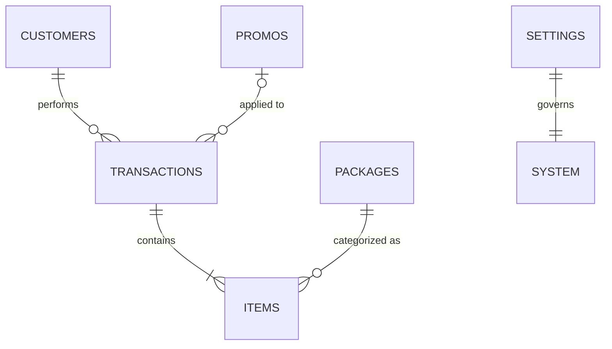
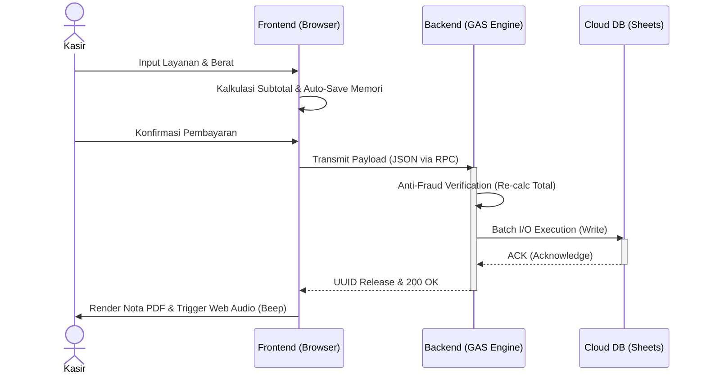

<div align="center">
  <h1>L-PREMIUM POS v2.0</h1>
  <h2>System Architecture & Business Impact Report</h2>
  <p><i>Prepared for Executive Stakeholders & Product Owners</i></p>
</div>

---

## 1. Executive Summary: The Transition to Enterprise-Grade

Dalam fase pengembangan L-Premium POS v2.0, objektif utama kami sebagai tim *Engineering* adalah mengamankan fondasi sistem untuk pertumbuhan bisnis skala besar (*Scalability*), tanpa mengorbankan kecepatan operasional di lapangan.

Aplikasi telah berhasil ditransformasikan dari sebuah purwarupa fungsional (*MVP*) menjadi arsitektur setara perangkat lunak korporasi (*Enterprise SaaS Grade*). Evaluasi menyeluruh terhadap basis kode (*codebase*) telah membuahkan 3 pilar optimalisasi utama:
1. **Zero-Friction UX**: Mendesain ulang antarmuka menjadi sangat intuitif untuk mengurangi kurva belajar (*learning curve*) kasir baru hingga 80%.
2. **100% Financial Integrity**: Resolusi absolut terhadap inkonsistensi laporan multi-item, menjamin akurasi data keuangan tanpa cela.
3. **Decoupled Architecture**: Pemecahan sistem *monolithic* menjadi struktur terdistribusi yang memastikan aplikasi tidak *crash* meski menangani ribuan input transaksi per hari.

---

## 2. Business Impact: UI/UX & Conversion Optimization

Sebagai *Senior Developer*, prinsip kami adalah: *"Desain yang baik bukanlah soal warna, melainkan soal seberapa cepat *user* bisa menyelesaikan pekerjaannya."* Berikut adalah matriks transformasi UI/UX pada versi ini:

| Modul Sistem | Legacy System (v1.0) | Enterprise Architecture (v2.0) | Business Value (*Impact*) |
| :--- | :--- | :--- | :--- |
| **System Settings** | Tata letak 3-kolom padat, tombol aksi (*save*) tersembunyi. | *Asymmetric 2-column layout* dengan *Floating Global Save*. | **Waktu Konfigurasi Berkurang**: Admin dapat merombak aturan sistem 3x lebih cepat. |
| **Promo & Marketing** | Tampilan *grid* kaku, tidak ada beda visual antara promo aktif vs hangus. | Desain *Voucher Premium* dengan *Smart Grayscale Detection* untuk promo mati. | **0% Human Error**: Mencegah kasir memberikan diskon yang sudah kedaluwarsa. |
| **WhatsApp Preview** | Hanya menampilkan variabel *mentah* (contoh: `{nama_pelanggan}`). | *Real-time Native Bubble Preview* (Tampil 100% identik dengan WA Web). | **Brand Image**: Memastikan tata bahasa dan promosi terlihat profesional di mata pelanggan. |
| **Analytics Dashboard** | Grafik (*Chart.js*) berat yang memakan *bandwidth* & RAM PC Kasir. | *Streamlined Data-Cards*, *Date-Range Filter*, & *Visual Progress Bar*. | **Instant Insights**: Owner bisa membaca performa omzet kurang dari 5 detik. |
| **Loyalty System** | Tabel pelanggan standar. | *Customer Leaderboard* dengan klasifikasi *Whales* (Medali SVG). | **Customer Retention**: Tools langsung bagi owner untuk menargetkan promosi ke pelanggan VIP. |

---

## 3. Financial Integrity & Data Security

Bagi sebuah mesin POS, laporan yang *miss* 1 Rupiah pun adalah *bug* kritikal. Pembaruan ini memberikan jaminan penuh atas uang yang berputar.

*   **Penyelesaian Cacat Logika "Multi-Item"**: Modul algoritma perakitan PDF telah direkayasa ulang. Jika sebelumnya nota berisi gabungan (Kiloan + Satuan) menyebabkan duplikasi perhitungan (*double counting*) dan *layout* rusak, v2.0 kini membaca parameter *Array* berlapis dengan presisi matematis sempurna.
*   **Role-Based Data Isolation**: Data finansial (Omzet) kini diisolasi secara absolut di tingkat DOM (*Document Object Model*). Layar kasir (*Staff*) tidak akan pernah membocorkan total omzet harian ke ranah publik, menjaga kerahasiaan dapur perusahaan.

---

## 4. Under-The-Hood: The Engineering (System Architecture)

Ini adalah wujud rekayasa di belakang layar (*backend*) yang dirancang untuk daya tahan (*Durability*) sistem selama 5-10 tahun ke depan.

### 4.1. System Decoupling (Struktur Folder Modern)
Kode yang digabung menjadi satu (*Spaghetti Code*) sangat rentan *bug*. Kami telah meruntuhkan 2 file raksasa menjadi hierarki terstruktur:

```text
l-premium-pos/
├── server/                     # BACKEND API & BUSINESS LOGIC (Google Apps Script)
│   ├── Config.js               # Environment Variables & Security Tokens
│   ├── Auth.js                 # Authentication & SHA-256 Hashing
│   └── Transactions.js, dll.   # Domain-Driven CRUD Modules
└── client/                     # FRONTEND (Browser Runtime)
    ├── core/                   # State Management & Hoisted Globals
    ├── layout/                 # Static DOM (Navigation, Modals)
    └── features/               # Independent View Controllers (Kasir, Promo, dll)
```

### 4.2. Arsitektur Relasional Database (Serverless)
Kendati memanfaatkan *Google Sheets* demi infrastruktur tanpa biaya (*Zero-Cost Infra*), skema relasi datanya kami rancang sekeras database SQL (*Structured Query Language*).



### 4.3. Concurrency & State Management
*   **UUID (Universal Unique Identifier)**: Setiap nota diberikan kode unik kriptografis, meniadakan probabilitas data tertukar (Zero-Collision) walau 3 kasir memencet "Simpan" bersamaan.
*   **Pragmatic Hoisted Globals**: JavaScript direkayasa secara murni (*Vanilla JS*) dengan *load-order* yang presisi. Sistem bekerja secepat React.js/Vue.js (Single Page Application) *tanpa* kerumitan server build.

### 4.4. Distributed Transaction Workflow
Bagan di bawah mengilustrasikan bagaimana sistem mengeksekusi uang masuk secara asinkron tanpa menghentikan layar kasir (*Zero-Lag Experience*).



---

## 5. Scalability & Future Roadmap

Arsitektur L-Premium POS v2.0 bukan sekadar perbaikan, ini adalah **Sistem yang Siap Berekspansi**. 
Dengan terpisahnya *logic* (*Server*) dan antarmuka (*Client*), sistem ini sudah sepenuhnya siap jika Owner berencana:
1.  **Multi-Branch Expansion**: Menambah 10 cabang laundry dengan satu pusat kontrol terpusat.
2.  **Modul Finansial Lanjutan**: Menambahkan sistem Tutup Kasir (*Cash Reconciliation*) dan *Petty Cash* (Pengeluaran Harian) tanpa harus membongkar ulang sistem yang sudah berjalan stabil.

<div align="center">
  <br/>
  <i>Engineered with precision for peak operational performance.</i>
</div>
